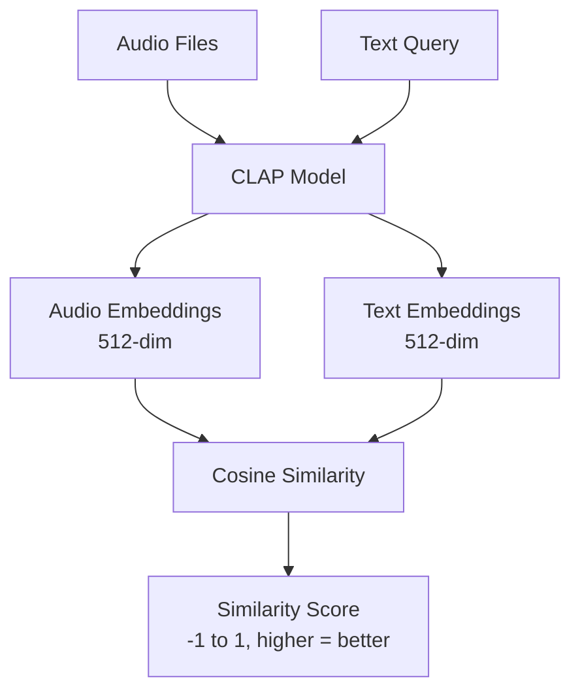

# CLAP Preliminary Analysis

## CLAP Introduction

**CLAP** (Contrastive Language-Audio Pretraining) is an audio-text embedding framework analogous to CLIP but for audio-language alignment. It creates aligned 512-dimensional embeddings for both audio and text, enabling natural language search over audio content.

- **Architecture:** HTSAT audio encoder + BERT text encoder
- **Training:** Contrastive learning on audio-text pairs
- **Capability:** Zero-shot classification and semantic search
- **Paper:** [Large-Scale Contrastive Language-Audio Pretraining](https://arxiv.org/abs/2211.06687) (ICASSP 2023)

## CLAP Models

| Model | Size | Training Data | GTZAN | Best For |
|-------|------|---------------|-------|----------|
| **music_audioset_epoch_15_esc_90.14.pt** ✅ | 2.35 GB | Music + AudioSet + LAION-630K | **71%** | **Music analysis** |
| music_speech_audioset_epoch_15_esc_89.98.pt | 2.35 GB | Music + Speech + AudioSet + LAION-630K | 51% | General audio |
| 630k-audioset-best.pt | 1.86 GB | AudioSet + LAION-630K | N/A | General <10s |

**Selected:** `music_audioset_epoch_15_esc_90.14.pt` - Best music understanding (71% GTZAN score), trained on ~4M samples with HTSAT-base encoder.

## Workflow

**Process:**
1. Load audio at 48kHz (CLAP requirement)
2. Generate audio embedding via CLAP
3. Generate text embedding from search query
4. Compute cosine similarity (dot product)
5. Rank results by similarity score

**Performance:** ~100-500ms/song (GPU), ~10ms/query, <1ms similarity search
