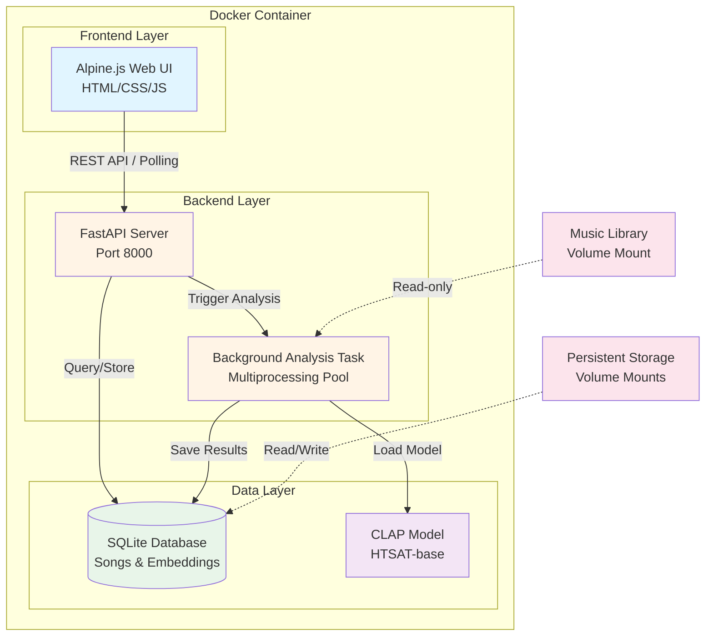
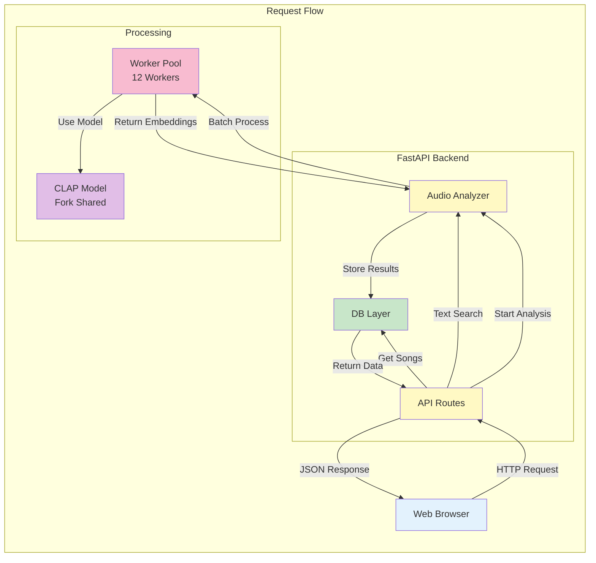
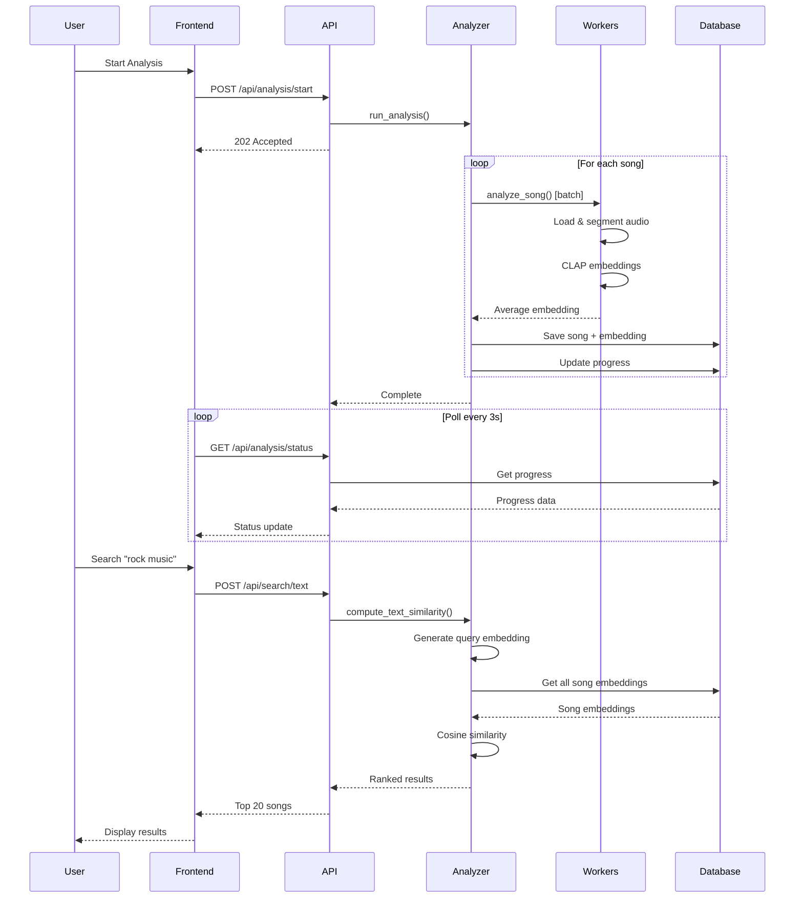

# Introduction

The Song Search web application is a containerized solution for AI-powered music search and discovery using CLAP (Contrastive Language-Audio Pretraining). This implementation provides an EXPERIMENTAL web interface that allows users to search their music library using natural language queries and discover similar songs through semantic audio understanding.

# Key Features

- 🔍 **Text Search**: Find songs using natural language descriptions ("energetic rock guitar", "calm piano music")
- 🎼 **Similarity Search**: Discover songs similar to your favorites based on audio characteristics
- 💾 **Persistent Storage**: Analysis results saved in SQLite database
- 🐳 **Single Container**: Everything runs in one lightweight Docker container
- 🎵 **Direct Playback**: Play songs directly from the web interface
- 📱 **Responsive UI**: Clean, modern interface built with Alpine.js


# How to Deploy

## Prerequisites

- Docker
- Docker Compose (optional, but recommended)
- CLAP model file (auto-downloaded on first run, ~2.35 GB)

## Option 1: Using Docker Compose (Recommended)

1. **Edit `docker-compose.yml`** and set your songs and config path:
   ```yaml
   volumes:
     - /path/to/your/songs:/app/data/songs:ro
     - /path/to/your/config:/app/config
   ```

2. **Run with one command**:
   ```bash
   docker compose up -d
   ```

3. **Access the web interface**:
   ```
   http://localhost:8000
   ```

# Architecture

## System Overview



## Component Architecture



## Data Flow



## Directory Structure

```
song-search/
├── backend/                          # Backend application
│   ├── main.py                       # FastAPI server (polling-based)
│   ├── database.py                   # SQLite operations & schema
│   ├── analysis.py                   # CLAP audio analysis logic
│   └── requirements.txt              # Python dependencies
├── frontend/                         # Frontend application
│   ├── index.html                    # Main web interface
│   ├── style.css                     # Styling
│   └── app.js                        # Alpine.js application
├── data/                             # Runtime data (mounted)
│   └── db/
│       └── analysis.db               # SQLite database (auto-created)
├── models/                           # Model storage (mounted)
│   └── music_audioset_epoch_15...   # CLAP model checkpoint
├── songs/                            # Music library (mounted read-only)
│   └── *.mp3, *.flac, etc.          # Audio files
├── Dockerfile                        # Container definition
├── docker-compose.yml                # Docker Compose configuration
├── entrypoint.sh                     # Container startup script
└── docs/
    └── 10-docker-final-implementation.md  # This document
```

## Volume Mounts

| Volume | Purpose | Required |
|--------|---------|----------|
| `/app/data/songs` | Your music library | ✅ Yes |
| `/app/data/db` | SQLite database (persisted) | ✅ Yes |
| `/app/models` | CLAP model (persisted) | ⚠️ Recommended |


## Database Schema

The SQLite database automatically initializes on first run with the following tables:

- **`config`**: App configuration (songs path, etc.)
- **`songs`**: Analyzed songs with embeddings, metadata, and stats
- **`query_results`**: Cached text query results for fast retrieval

## API Endpoints

- `GET /` - Web interface
- `GET /api/config` - Get configuration
- `POST /api/config` - Update configuration
- `POST /api/analysis/start` - Start background analysis
- `GET /api/analysis/status` - Get analysis progress
- `POST /api/search/text` - Search by text query
- `POST /api/search/similar` - Find similar songs
- `GET /api/songs` - Get all analyzed songs
- `GET /api/audio/{song_id}` - Stream audio file
- `WS /ws/analysis` - WebSocket for real-time progress

## Technical Stack

| Component | Technology | Version |
|-----------|-----------|---------|
| Backend Framework | FastAPI | 0.123.8 |
| Web Server | Uvicorn | 0.38.0 |
| Frontend | Alpine.js | 3.13.5 |
| Database | SQLite | 3.x |
| ML Model | CLAP HTSAT-base | - |
| Audio Processing | librosa | 0.11.0 |
| Deep Learning | PyTorch | 2.9.1 |
| Transformers | Hugging Face | 4.57.3 |
| Container | Docker | - |

## CLAP Model Configuration

- **Model Architecture**: HTSAT-base (Hierarchical Token-Semantic Audio Transformer)
- **Checkpoint**: `music_audioset_epoch_15_esc_90.14.pt` (music-optimized)
- **Segment Length**: 10 seconds (480,000 samples at 48kHz)
- **Hop Length**: 5 seconds (50% overlap)
- **Sample Rate**: 48 kHz
- **Embedding Dimension**: 512
- **Processing**: Parallel across 12 CPU workers with fork mode

## Analysis Process

1. **Audio Loading**: Load audio file using librosa, resample to 48kHz
2. **Segmentation**: Create overlapping 10-second segments
3. **Batch Processing**: Group segments into batches for efficient processing
4. **Embedding Generation**: CLAP model generates 512-dim embeddings (parallel)
5. **Aggregation**: Compute average embedding (L2 normalized)
6. **Metadata Extraction**: Parse ID3 tags or filename (Artist - Title pattern)
7. **Storage**: Save to SQLite with embeddings, metadata, and statistics

## Search Methods

- **Text Search**: 
  - Generate CLAP embedding for query text
  - Compute cosine similarity with all song embeddings
  - Return top-N ranked by similarity score
  
- **Similarity Search**:
  - Retrieve target song's embedding from database
  - Compute cosine similarity with all other embeddings
  - Return top-N most similar songs

## Optimization Features

- **Fork Mode Multiprocessing**: Shared model memory across workers
- **Batch Processing**: Segments processed in groups of 3-4
- **Smart Polling**: Frontend only polls during active analysis
- **Embedding Caching**: All results persisted in database
- **Lazy Model Loading**: Text model loaded only when needed

# Stopping the Container

```bash
# Docker Compose
docker compose down

# Docker
docker stop song-search
docker rm song-search
```