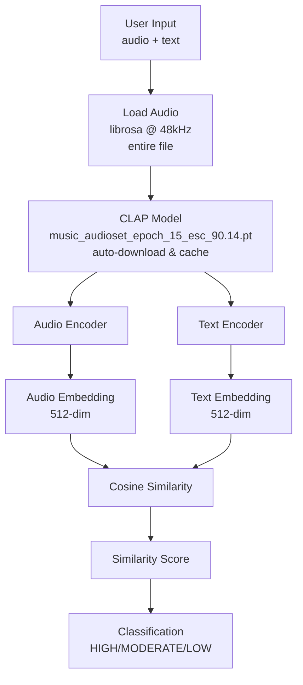

# Initial Implementation

**Date:** 1 December 2025

## Approach

CLI-based single audio file analyzer that computes similarity between one song and a text query using CLAP embeddings. Model downloads automatically on first run and caches locally in `./models/` directory.

## Architecture



**Key Components:**
- `clap_analysis.py` - Main CLI tool
- `requirements.txt` - Dependencies (laion-clap, librosa, torch, torchvision, numpy)
- `models/` - Model cache directory (auto-created)

## Example Usage

```bash
# 1. Create virtual environment
python3 -m venv venv

# 2. Activate virtual environment
source venv/bin/activate

# 3. Install dependencies
pip install -r requirements.txt

# 4. Run analysis
python clap_analysis.py ./songs/you-song.mp3 "text to search"

# 5. Deactivate when done
deactivate
```

**Good Match Examples:**
```bash
python clap_analysis.py ./songs/HoliznaCC0\ -\ Dreams\ Of\ Lilith\ -\ Rock.mp3 "Electric guitar songs"
python clap_analysis.py ./songs/Zane\ Little\ -\ Always\ and\ Forever\ -\ Pop.mp3 "Pop relax songs"
```

**Bad Match Example:**
```bash
python clap_analysis.py ./songs/Zane\ Little\ -\ Always\ and\ Forever\ -\ Pop.mp3 "Electric guitar songs"
```

## Expected Output

```
============================================================
CLAP Audio Analysis
============================================================
Audio file: ./songs/HoliznaCC0 - Dreams Of Lilith - Rock.mp3
Search text: 'Electric guitar songs'
============================================================

Loading audio: ./songs/HoliznaCC0 - Dreams Of Lilith - Rock.mp3
Audio loaded: 364.46 seconds, 48000 Hz
Initializing CLAP model...
Model: music_audioset_epoch_15_esc_90.14.pt (music-optimized)
Using cached model from: ./models/music_audioset_epoch_15_esc_90.14.pt
Model loaded successfully!

Analyzing audio...
Computing audio embedding...
Computing text embedding for: 'Electric guitar songs'

============================================================
RESULTS
============================================================
Similarity Score: 0.4235

✅ HIGH similarity - Audio matches the text description well
============================================================
```

**Similarity Thresholds:**
- `> 0.3` = ✅ HIGH similarity (strong match)
- `> 0.15` = ⚠️ MODERATE similarity (partial match)
- `≤ 0.15` = ❌ LOW similarity (no match)
