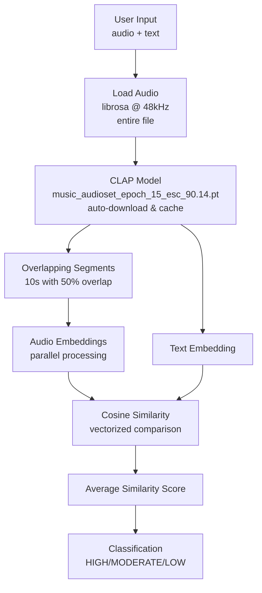
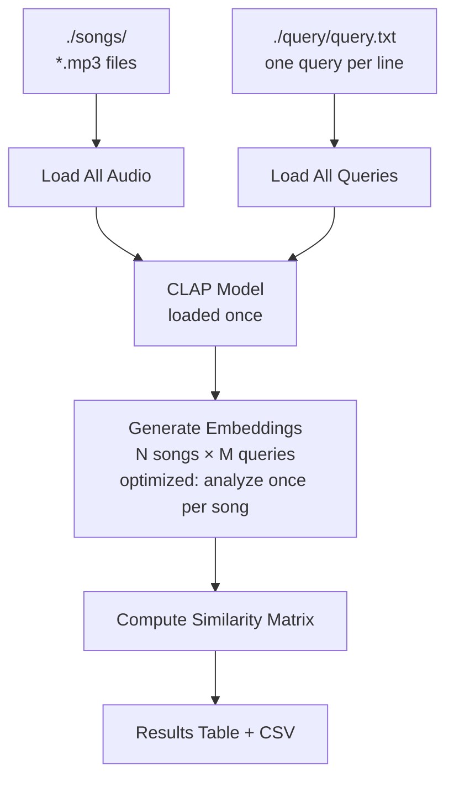

# Initial Implementation

## Approach

Two operational modes:

1. **Single Analysis** (`single_analysis.py`) - Analyzes one song against one text query
2. **Batch Analysis** (`multiple_analysis.py`) - Analyzes all songs in `./songs/` against all queries in `./query/query.txt`

Model downloads automatically on first run and caches locally in `./models/` directory.

## Architecture

### Single Analysis



### Batch Analysis



**Key Components:**
- `single_analysis.py` - Single file analysis CLI
- `multiple_analysis.py` - Batch processing CLI
- `clap_analysis.py` - Core CLAP analysis module (library)
- `requirements.txt` - Dependencies (laion-clap, librosa, torch, torchvision, numpy)
- `models/` - Model cache directory (auto-created)
- `songs/` - Audio files directory
- `query/` - Text queries directory

## Example Usage

### Single Analysis

```bash
# Setup
python3 -m venv venv
source venv/bin/activate
pip install -r requirements.txt

# Analyze one song
python single_analysis.py <audio_file> "<search_text>"

# Example
python single_analysis.py "./songs/HoliznaCC0 - Dreams Of Lilith - Rock.mp3" "Electric guitar songs"
```

### Batch Analysis

```bash
# Analyze all songs against all queries
python multiple_analysis.py

# Reads from:
#   - ./songs/*.mp3 (all audio files)
#   - ./query/query.txt (one query per line)
# 
# Outputs:
#   - Console results table
#   - results_YYYYMMDD_HHMMSS.csv
```

**Sample query.txt:**
```
Pop relax songs
Electric guitar songs
high energy
Pop songs
```

## Expected Output

### Single Analysis

```
================================================================================
CLAP Audio Analysis
================================================================================
Audio file: ./songs/HoliznaCC0 - Dreams Of Lilith - Rock.mp3
Search text: 'Electric guitar songs'
================================================================================

🔧 Initializing CLAP model...
   CPU cores: 8 | Workers: 8
   Segments: 10s with 50% overlap
   Loading model weights... ✅

🔍 Analyzing audio against query...

      📊 Analyzing song (loading + 1 queries)... ✅ (18.45s)
      [1/1] Comparing: "Electric guitar songs" → 0.4235 ✅ HIGH (0.15s)

================================================================================
RESULTS
================================================================================
Similarity Score: 0.4235
Duration: 364.46s
Segments analyzed: 71

✅ HIGH similarity - Audio matches the text description well
================================================================================

Detailed Statistics:
  Average score: 0.4235
  Maximum score: 0.5123
  Minimum score: 0.3456
  Std deviation: 0.0421
```

### Batch Analysis

```
🔧 Initializing CLAP model...
   CPU cores: 8 | Workers: 8
   Segments: 10s with 50% overlap
   Loading model weights... ✅

================================================================================
🎵 [1/7] Aaron Dunn - Minuet - Notebook for Anna Magdalena - Classical.mp3
================================================================================
      📊 Analyzing song (loading + 17 queries)... ✅ (18.23s)
      [1/17] Comparing: "pop music" → 0.2239 ⚠️ MODERATE (0.15s)
      [2/17] Comparing: "electric guitar" → 0.1808 ⚠️ MODERATE (0.12s)
      [3/17] Comparing: "rock music" → -0.0066 ❌ LOW (0.11s)
      [4/17] Comparing: "classical music" → 0.3984 ✅  HIGH (0.13s)
      [5/17] Comparing: "piano" → 0.4387 ✅  HIGH (0.14s)
      ...

⏱️  Total time for this song: 20.45s

💾 Results saved to: results_20251202_143022.csv
```

**Similarity Thresholds:**
- `> 0.3` = ✅  HIGH similarity (strong match)
- `> 0.15` = ⚠️ MODERATE similarity (partial match)
- `≤ 0.15` = ❌ LOW similarity (no match)

## Performance Characteristics

### Optimizations (as of Dec 2, 2025)
- **Overlapping segments**: 10s windows with 50% overlap for full song coverage
- **Parallel processing**: Uses all CPU cores for segment analysis
- **Smart caching**: Each song analyzed once, then compared against all queries (~15-17x speedup)
- **Deterministic results**: Consistent scores across multiple runs
- **Clean output**: All warnings suppressed

### Typical Performance
- **Model loading**: ~2-3 seconds (one-time per session)
- **Audio loading + segmentation**: ~3-5 seconds per song
- **Segment analysis**: ~15-20 seconds per song (depends on length and CPU cores)
- **Query comparison**: ~0.1-0.2 seconds per query (after song is analyzed)

**Example:** 3-minute song with 17 queries
- Old approach: ~270 seconds (17 × 15s per query)
- New approach: ~20 seconds (18s analysis + 17 × 0.15s queries)
