# Initial Implementation

**Date:** 1 December 2025

## Approach

Two operational modes:

1. **Single Analysis** (`clap_analysis.py`) - Analyzes one song against one text query
2. **Batch Analysis** (`multiple_analysis.py`) - Analyzes all songs in `./songs/` against all queries in `./query/query.txt`

Model downloads automatically on first run and caches locally in `./models/` directory.

## Architecture

### Single Analysis


### Batch Analysis



```mermaid
graph TD
    A[./songs/<br/>*.mp3 files] --> C[Load All Audio]
    B[./query/query.txt<br/>one query per line] --> D[Load All Queries]
    C --> E[CLAP Model]
    D --> E
    E --> F[Generate Embeddings<br/>N songs × M queries]
    F --> G[Compute Similarity Matrix]
    G --> H[Results Table + CSV]
```

**Key Components:**
- `clap_analysis.py` - Single file analysis CLI
- `multiple_analysis.py` - Batch processing CLI
- `requirements.txt` - Dependencies (laion-clap, librosa, torch, torchvision, numpy)
- `models/` - Model cache directory (auto-created)
- `songs/` - Audio files directory
- `query/` - Text queries directory

## Example Usage

### Single Analysis

```bash
# Setup
python3 -m venv venv
source venv/bin/activate
pip install -r requirements.txt

# Analyze one song
python clap_analysis.py <audio_file> "<search_text>"

# Example
python clap_analysis.py ./songs/HoliznaCC0\ -\ Dreams\ Of\ Lilith\ -\ Rock.mp3 "Electric guitar songs"
```

### Batch Analysis

```bash
# Analyze all songs against all queries
python multiple_analysis.py

# Reads from:
#   - ./songs/*.mp3 (all audio files)
#   - ./query/query.txt (one query per line)
# 
# Outputs:
#   - Console results table
#   - results_YYYYMMDD_HHMMSS.csv
```

**Sample query.txt:**
```
Pop relax songs
Electric guitar songs
high energy
Pop songs
```

## Expected Output

### Single Analysis

```
============================================================
CLAP Audio Analysis
============================================================
Audio file: ./songs/HoliznaCC0 - Dreams Of Lilith - Rock.mp3
Search text: 'Electric guitar songs'
============================================================

Loading audio: ./songs/HoliznaCC0 - Dreams Of Lilith - Rock.mp3
Audio loaded: 364.46 seconds, 48000 Hz
Initializing CLAP model...
Model: music_audioset_epoch_15_esc_90.14.pt (music-optimized)
Using cached model from: ./models/music_audioset_epoch_15_esc_90.14.pt
Model loaded successfully!

Analyzing audio...
Computing audio embedding...
Computing text embedding for: 'Electric guitar songs'

============================================================
RESULTS
============================================================
Similarity Score: 0.4235

✅ HIGH similarity - Audio matches the text description well
============================================================
```

### Batch Analysis

```
================================================================================
CLAP MULTIPLE AUDIO ANALYSIS
================================================================================

📝 Loading queries...
   Found 4 queries:
   1. "Pop relax songs"
   2. "Electric guitar songs"
   3. "high energy"
   4. "Pop songs"

🎵 Loading audio files...
   Found 3 audio files:
   1. Aaron Dunn - Minuet - Notebook for Anna Magdalena - Classical.mp3
   2. HoliznaCC0 - Dreams Of Lilith - Rock.mp3
   3. Zane Little - Always and Forever - Pop.mp3

...

================================================================================
RESULTS
================================================================================

🎵 HoliznaCC0 - Dreams Of Lilith - Rock.mp3
--------------------------------------------------------------------------------
  ❌ LOW      | 0.1234 | "Pop relax songs"
  ✅ HIGH     | 0.4235 | "Electric guitar songs"
  ⚠️  MODERATE | 0.2156 | "high energy"
  ❌ LOW      | 0.0987 | "Pop songs"

💾 Results saved to: results_20251201_143022.csv
```

**Similarity Thresholds:**
- `> 0.3` = ✅ HIGH similarity (strong match)
- `> 0.15` = ⚠️ MODERATE similarity (partial match)
- `≤ 0.15` = ❌ LOW similarity (no match)
